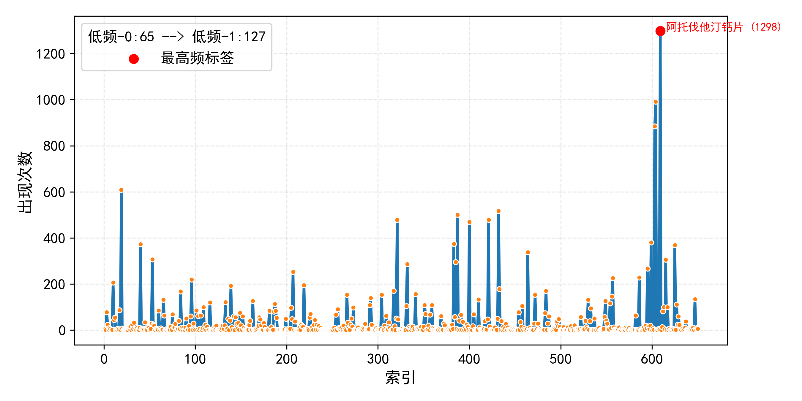
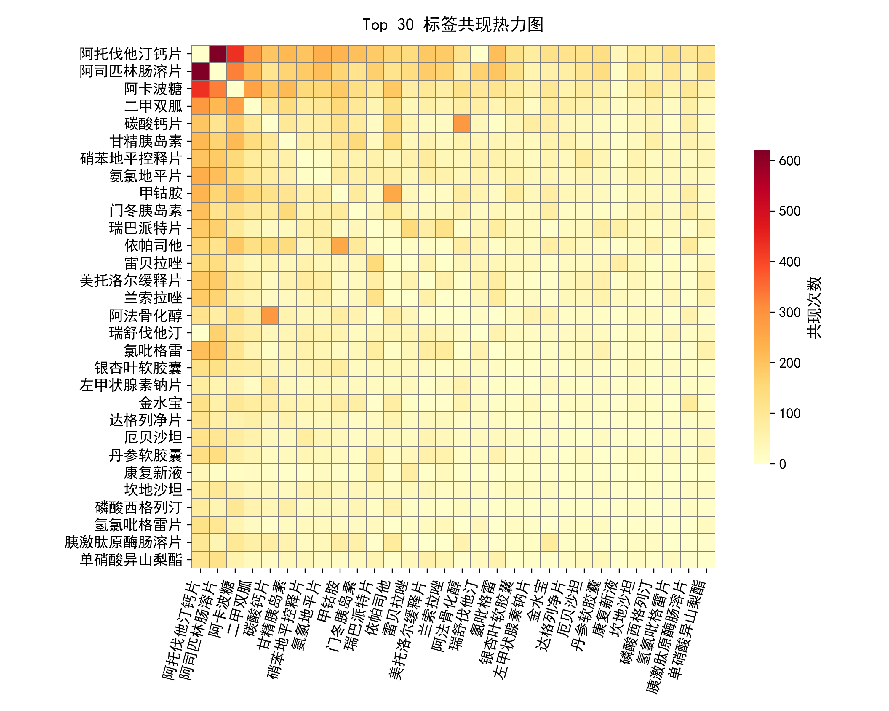

# 实验过程记录

## Q1. Base-Decoder vs Base-Encoder Model?

### 1. 纯使用lm_head建模

1. 测试集(none代表测试集官网看不到非sota的结果, 即代表该方法没有超过之前的方法)

| 实验配置 | F1_score | score |
|------|----------|----------|
| hidden直接接入分类层 | 0.2999 | 0.2515 |
| hidden先接入一个线性映射层至hidden//2,然后接入GELU,再接入分类层 | none | none |

2. 验证集(训练集划分出20%)

| 实验配置 | F1_score | score |
|------|----------|----------|
| hidden直接接入分类层 | 忘记留了，但肯定比下面的高 | 忘记留了，但肯定比下面的高 |
| hidden先接入一个线性映射层至hidden//2,然后接入GELU,再接入分类层 | 0.0197 | 0.0148 |

注意：hidden先接入一个线性映射层至hidden//2,然后接入GELU,再接入分类层的具体分数如下

    "jaccard_th0.5": 0.010018617703807655,
    "precision_avg_th0.5": 0.010115171478057346,
    "recall_avg_th0.5": 0.5527407709864673,
    "f1_avg_th0.5": 0.01975692864183485,
    "score_th0.5": 0.014887773172821252,

    可以看到，具体来说是精确率和Jaccard非常低，也就是说，模型几乎在瞎猜，Recall很高是因为模型给出了很多药品，即查的全，但是查的不准。

进一步地，我们进行了上下文学习检索，精度效果同上，Recall很高，但是Jaccard和Precision很低。

为此，我们认为，Base-Decoder Only Model本身表现就不是特别好。

### 2. Base-Encoder Bert-Chinese-Base

## Q2. 长尾分布问题

## Q3. 多任务学习
ing

## Q4. 多细粒度特征分类
ing

## Q5. 标签不完备与标签之间的相互排斥性
ing
